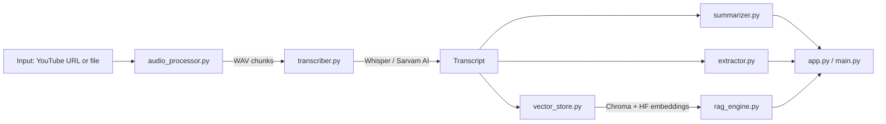

# AI Video Assistant

An end-to-end pipeline that converts spoken content — from a YouTube video or a local audio/video file — into a structured, searchable knowledge artifact: transcript, summary, action items, key decisions, open questions, and a retrieval-augmented chat interface for follow-up questions.

**Live demo:** https://ai-video-assistant-iushdhtajse55xx636y5nb.streamlit.app/

[](https://www.python.org/)
[](https://www.langchain.com/)
[](https://mistral.ai/)
[](https://github.com/openai/whisper)
[](https://www.trychroma.com/)
[](https://streamlit.io/)

---

## Overview

Reviewing recorded meetings and long-form videos manually is time-consuming. This project automates that process: it transcribes the audio, extracts the information that actually matters (decisions, tasks, open questions), and exposes the transcript through a question-answering interface so a user doesn't need to scrub through the recording to find a detail.

The system supports two transcription paths — a local Whisper model for English audio, and the Sarvam AI speech-to-text-translate API for Hinglish audio — so it works reasonably well on the kind of mixed-language content common in Indian business and academic settings.

## Key Features

- **Flexible input** — accepts a YouTube URL or a local file path; audio is normalized to 16 kHz mono WAV and chunked automatically for long recordings.
- **Dual transcription engines** — Whisper (local, offline) for English; Sarvam AI (`saaras:v2.5`) for Hinglish, with automatic 25-second sub-chunking to satisfy the API's request-length limit.
- **Automatic title generation** — a short, descriptive title derived from the transcript.
- **Map-reduce summarization** — the transcript is split, summarized chunk-by-chunk, and the partial summaries are combined into a single coherent summary, avoiding context-window limits on long recordings.
- **Structured extraction** — action items (with owner and deadline where mentioned), key decisions, and open questions, each returned as a formatted list.
- **Retrieval-augmented chat** — the transcript is embedded and stored in a vector database; user questions are answered strictly from retrieved context, with an explicit fallback when the answer isn't present.
- **Two interfaces** — a Streamlit web app for interactive use, and a CLI for scripted/local use.

## Architecture



| Stage | Module | Responsibility |
|---|---|---|
| 1 | `audio_processor.py` | Download (yt-dlp) or convert (pydub) input to WAV; chunk into fixed-length segments |
| 2 | `transcriber.py` | Route each chunk to Whisper or Sarvam AI based on selected language |
| 3 | `summarizer.py` | Generate title; map-reduce summarization over transcript chunks |
| 4 | `extractor.py` | Extract action items, decisions, and open questions via separate LCEL chains |
| 5 | `vector_store.py` | Chunk transcript, embed with `all-MiniLM-L6-v2`, persist to ChromaDB |
| 6 | `rag_engine.py` | Retrieve relevant chunks and answer questions via a context-grounded prompt |
| 7 | `app.py` / `main.py` | Streamlit UI and CLI entry points |

## Tech Stack

| Layer | Technology |
|---|---|
| Audio acquisition | `yt-dlp`, `pydub`, `ffmpeg` |
| Speech-to-text | `openai-whisper` (local), Sarvam AI API (Hinglish) |
| LLM orchestration | LangChain (LCEL) |
| LLM | Mistral — `mistral-small-latest` |
| Embeddings | HuggingFace `all-MiniLM-L6-v2` |
| Vector store | ChromaDB |
| Interface | Streamlit |
| Configuration | python-dotenv |

## Project Structure

```
.
├── app.py                  # Streamlit web application
├── main.py                 # CLI entry point
├── requirements.txt
├── .env                    # API keys (not committed)
├── utils/
│   └── audio_processor.py  # Download, convert, and chunk audio
└── core/
    ├── transcriber.py      # Whisper / Sarvam AI transcription
    ├── summarizer.py       # Title generation and map-reduce summarization
    ├── extractor.py        # Action items, decisions, open questions
    ├── vector_store.py     # Embedding and Chroma vector store
    └── rag_engine.py       # LCEL retrieval-augmented chat chain
```

## Setup

### Prerequisites
- Python 3.10+
- FFmpeg (system binary — not a Python package)
- API keys: [Mistral](https://mistral.ai/), [Sarvam AI](https://www.sarvam.ai/) (only required for Hinglish transcription)

### Installation

```bash
git clone <your-repo-url>
cd ai-video-assistant

python -m venv venv
venv\Scripts\activate      # Windows
source venv/bin/activate   # macOS / Linux

pip install -r requirements.txt
```

### Install FFmpeg

```bash
winget install ffmpeg     # Windows
brew install ffmpeg       # macOS
sudo apt install ffmpeg   # Linux (Debian/Ubuntu)
```

Verify:
```bash
ffmpeg -version
ffprobe -version
```

### Environment variables

Create a `.env` file in the project root:

```env
MISTRAL_API_KEY=your_mistral_api_key
SARVAM_API_KEY=your_sarvam_api_key
WHISPER_MODEL=small
SARVAM_STT_MODEL=saaras:v2.5
```

## Usage

**Web app:**
```bash
streamlit run app.py
```

**CLI:**
```bash
python main.py
```
The CLI prompts for a YouTube URL or file path and a language (`english` / `hinglish`), runs the full pipeline, and then drops into an interactive chat loop over the transcript.

## Design Notes

- **Map-reduce summarization** was chosen over single-pass summarization to handle transcripts that exceed the LLM's effective context window without truncating content.
- **Separate LCEL chains** for action items, decisions, and questions keep each extraction task narrowly scoped, which produces more consistent output than a single combined prompt.
- **Sarvam AI's 30-second request limit** is handled transparently by sub-chunking each audio segment into 25-second pieces and concatenating the results.
- **RAG answers are context-constrained** — the prompt explicitly instructs the model to say when an answer isn't present in the transcript, reducing hallucinated responses.

## Roadmap

- [ ] Speaker diarization for multi-speaker recordings
- [ ] Export results to PDF / Notion
- [ ] Broader language support beyond English and Hinglish
- [ ] Persistent chat history across sessions

## Author

**Omkar Salunke**
B.Sc. Computer Science (AI & Data Science), Savitribai Phule Pune University
